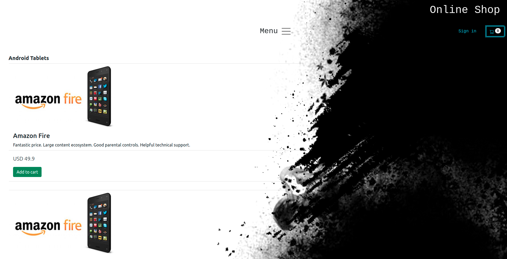
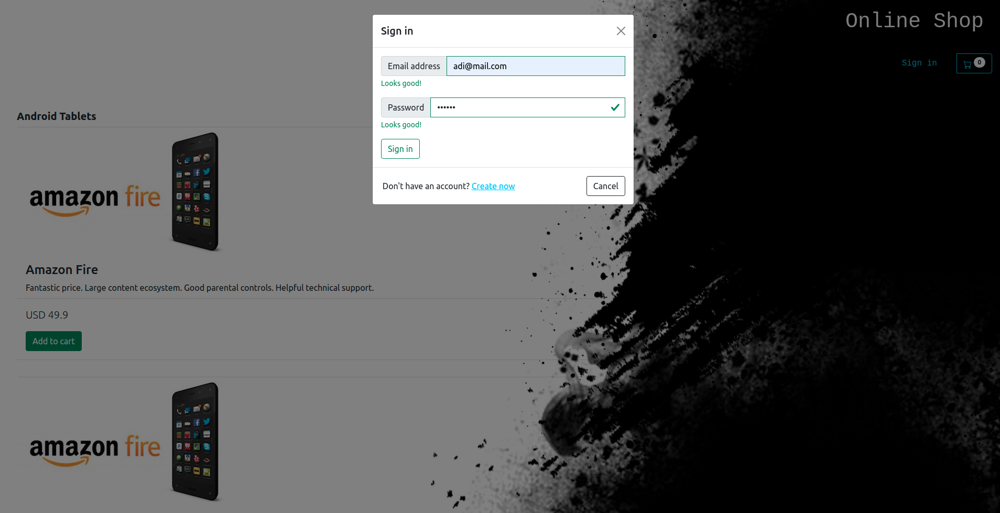
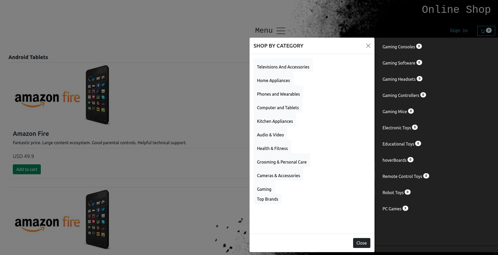
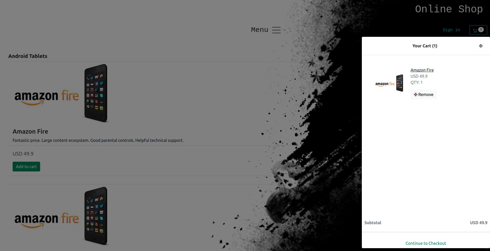
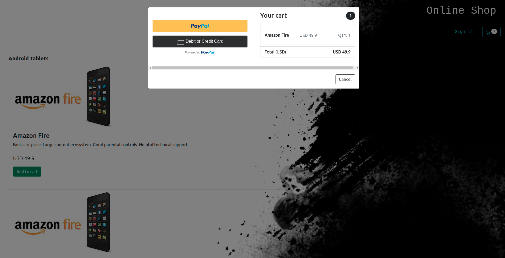

## Online Shop

## Description

* This is an online shop where you can buy all kinds of products, from TVs to beauty products and more.
* In the menu you can sort products by category or suppliers.
* You can make payments as quest or as a registered user with paypal or credit card.
* Data persistence can be done very easily both in the database and in memory.

## Technologies used

Java, PostgreSQL, Maven, Thymeleaf, Bootstrap, Python, Js, Html, Css

## Installation

Execute init_db.sql into your psql db. 
Create connection.properties in resources, add Db name, user and password.

## Implementation

Home page:

Login:

Menu:

Shoping cart:

Payment:

